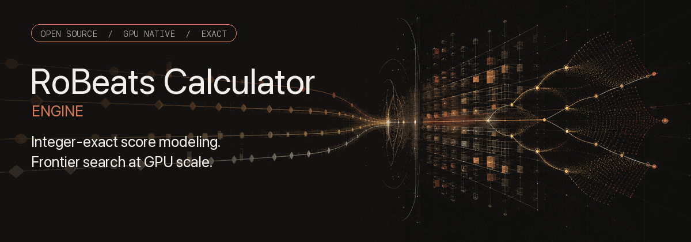
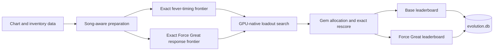

<div align="center">



# RoBeats Calculator Engine

**The #1 state-of-the-art RoBeats calculator—integer-exact scoring, exact timing frontiers, and GPU-native search.**

[](https://www.python.org/downloads/)
[](LICENSE)
[](https://numba.pydata.org/)
[](https://www.taichi-lang.org/)
[](https://robeatsmeta.net)

[Try RoBeatsMeta](https://robeatsmeta.net) · [Getting started](#getting-started) · [Technical evidence](#technical-evidence) · [Governance](GOVERNANCE.md) · [Contributing](CONTRIBUTING.md)

</div>

> [!NOTE]
> RoBeats Calculator Engine is an independent community project. It is not affiliated with or endorsed by RoBeats, Roblox, or any game publisher. “#1 state-of-the-art” is the project’s brand position, grounded in the modeled surfaces and verification standards documented below; it does not mean the outer genetic loadout search is exhaustive.

## Overview

RoBeats Calculator Engine searches gear, Mini, gem, fever-timing, and Force Great strategies for a selected chart. It combines a GPU-native genetic search with exact scoring and timing models, then stores the best Base and Force Great results separately in SQLite.

This is production community infrastructure, not a showcase-only calculator. The engine supplies chart metadata and on-demand optimization to [RoBeatsMeta](https://robeatsmeta.net), while remaining independently runnable and auditable from a source checkout.

### Community footprint

Repository snapshot as of July 25, 2026:

| Signal | Evidence |
|---|---|
| Supported catalog | 967 unique chart titles across 2,249 tracked difficulty files |
| Engineering depth | 650 Python files and 650 invariant/implementation records |
| Verification surface | 234 focused test modules, including CPU/GPU parity and exact-score regression coverage |
| Maintenance activity | 1,825 commits; 876 commits and 78 merged-PR commits in the preceding 90 days |
| Production role | Optimizer and chart-catalog backend for [RoBeatsMeta](https://robeatsmeta.net) |

See [`docs/COMMUNITY_IMPACT.md`](docs/COMMUNITY_IMPACT.md) for definitions, reproducible counting commands, and the evidence still needed for user/adoption claims.

### Highlights

| Area | What the optimizer provides |
|---|---|
| Loadout search | Multi-start GPU search across six gear slots and three Mini slots |
| Exact score model | Integer floors, combo order, Fever membership, Great penalties, head-note masks, and body counts |
| Fever timing | Exact non-dominated timing frontiers rather than a small set of guessed timelines |
| Force Greats | Reachable response frontiers with lane, chart-order, and timing constraints |
| Mini Ascension | Song-aware universal and elemental bonuses |
| Persistence | Separate Base and Force Great leaderboards, warm starts, and compatible frontier caches |
| Integration | CLI and HTTP service interfaces for official and custom charts |

> [!IMPORTANT]
> Score evaluation, timing frontiers, ties, and witnesses are modeled exactly for supported actions. The outer loadout search is a genetic search, so a result is the best solution found within the configured search budget—not a proof that no better loadout exists.

## Requirements

- Python 3.10 or newer
- A Vulkan-capable GPU with current graphics drivers
- Git
- Disk space for dependencies, JIT output, chart data, and frontier caches

Production optimization is GPU-first through Taichi/Vulkan. CPU implementations are used for reference and verification, not as a production fallback.

## Getting started

### 1. Clone the repository

```bash
git clone https://github.com/TheBaconactor/RoBeats-Calculator-Engine.git
cd RoBeats-Calculator-Engine
```

### 2. Create a virtual environment

<details open>
<summary><strong>macOS or Linux</strong></summary>

```bash
python3 -m venv .venv
source .venv/bin/activate
python -m pip install --upgrade pip
python -m pip install -r requirements.txt
```

</details>

<details>
<summary><strong>Windows PowerShell</strong></summary>

```powershell
py -3.10 -m venv .venv
.\.venv\Scripts\Activate.ps1
python -m pip install --upgrade pip
python -m pip install -r requirements.txt
```

</details>

For development and testing, also install `requirements-dev.txt`:

```bash
python -m pip install -r requirements-dev.txt
```

### 3. Configure a chart

The repository includes chart and gear data under [`Data/`](DATA.md). Set `Song_Name` and `Difficulty` in `config.ini`. Use `TargetPrimary` and `TargetSecondary` to narrow the queue when needed.

`config.ini.example` contains the same minimal defaults if you need to restore the configuration.

### 4. Run the optimizer

```bash
python main.py
```

The first run may take longer while Numba and Taichi compile kernels and the optimizer builds missing frontiers. Later runs reuse compatible caches under `bin/`.

Press `Ctrl+C` once for a graceful shutdown or twice to force an exit. You can also create `bin/STOP`; set `METAFINDER_STOP_FILE` to use another stop-file path.

## Usage

```bash
python main.py                                # Run the optimizer
python -m gear_optimizer.cli run              # Run through the module CLI
python -m gear_optimizer.cli meta             # Run cross-song GeneralMeta analysis
python -m gear_optimizer.cli sync-data        # Rebuild gear CSVs from exported game data
python -m tools list                          # List maintained developer tools
```

Generated results are stored in `evolution.db` by default. Override the location with `METAFINDER_EVOLUTION_DB`.

### HTTP service

The service interface supports website integration and self-hosted deployments:

```bash
python -m gear_optimizer.robeatsmeta_service --host 127.0.0.1 --port 8765
```

| Endpoint | Purpose |
|---|---|
| `GET /songs` | Read official chart metadata from the published data snapshot |
| `POST /optimize` | Optimize an official chart or supplied chart text |
| `GET /metafinder/v1/manifest` | Read the authenticated frontier-distribution manifest |

Bind to loopback unless the service is behind a trusted boundary. Set `ROBEATSMETA_OPTIMIZER_API_TOKEN` before exposing it to a network.

<details>
<summary><strong>Managed frontier distribution</strong></summary>

The production deployment behind RoBeatsMeta uses one authoritative host to build and publish frontier bundles. Trusted clients authenticate to the host and install SHA-256-verified code, data, and frontier revisions.

Community clones do not require frontier credentials. If `bin/frontier_client_credentials.json` is absent, hosted synchronization is skipped and the optimizer uses the local checkout and `Data/` tree.

| Variable | Purpose |
|---|---|
| `METAFINDER_FRONTIER_SERVER_URL` | Hosted update origin |
| `METAFINDER_FRONTIER_CREDENTIALS_FILE` | Per-installation client credential |
| `ROBEATSMETA_OPTIMIZER_SERVICE_MODE` | Disable client-side sync on the authoritative host |
| `ROBEATSMETA_FRONTIER_CLIENTS_FILE` | Host-side client registry |
| `ROBEATSMETA_FRONTIER_GIT_REMOTE` / `ROBEATSMETA_FRONTIER_GIT_BRANCH` | Repository ref polled by the host |
| `METAFINDER_EVOLUTION_DB` | External results database path |

Never commit client credentials, server registries, API tokens, or deployment secrets.

</details>

## Technical evidence

The “state-of-the-art” position is tied to inspectable technical work:

- Exact per-note integer scoring and canonical rescoring: [`gear_optimizer/solver/scoring/`](gear_optimizer/solver/scoring/)
- Non-dominated fever-timing frontiers: [`docs/FEVER_TIMELINE_MATH.md`](docs/FEVER_TIMELINE_MATH.md)
- Physically reachable Force Great response surfaces: [`docs/ANALYTICAL_FG_PROBLEM.md`](docs/ANALYTICAL_FG_PROBLEM.md)
- GPU-native GA and frontier execution: [`docs/ARCHITECTURE.md`](docs/ARCHITECTURE.md)
- Separate Base and Force Great persistence authority: [`docs/DATABASE_SCHEMA.md`](docs/DATABASE_SCHEMA.md)
- Hundreds of decision records preserving the reasoning behind correctness and performance changes: [`docs/Implementation Records/README.md`](docs/Implementation%20Records/README.md)

The exact components preserve integer floors, timing order, ties, witnesses, and supported reachability semantics. The outer gear/Mini genetic search remains budget-bounded and heuristic.

## How it works



1. Discover chart, gear, Mini, and Stats data in the local `Data/` tree.
2. Materialize song-specific state, including Mini Ascension effects.
3. Load or build compatible timing and Force Great frontier caches.
4. Run the Taichi/Vulkan search while CPU preparation and persistence work overlap.
5. Rescore canonical results and persist Base and Force Great leaderboards separately.

Deliberate Okay, Miss, and combo-break strategies are outside the supported search model.

## Repository layout

```text
RoBeats-Calculator-Engine/
├── gear_optimizer/       # Optimizer, scoring, persistence, and service code
├── general_meta/         # Cross-song analysis
├── tests/                # CPU, GPU, parity, and regression coverage
├── tools/                # Verification and maintenance tools
├── docs/                 # Architecture, math, and implementation records
├── Data/                 # Bundled charts and gear data
├── config.ini            # Chart and queue selection
└── main.py               # Primary entry point
```

Runtime databases, caches, logs, credentials, and generated artifacts are intentionally excluded from version control. Keep secrets out of `config.ini`.

## Development

Run the CPU/reference suite and linter before opening a pull request:

```bash
python -m pytest -m "not gpu" tests/
python -m ruff check .
```

Changes to GPU execution, timing, cache behavior, or reachability also require Vulkan-facing coverage:

```bash
python -m pytest -m gpu tests/
```

See [`CONTRIBUTING.md`](CONTRIBUTING.md) for project conventions and pull-request expectations. Repository authority and protected assets are defined in [`GOVERNANCE.md`](GOVERNANCE.md).

## Troubleshooting

<details>
<summary><strong>Data paths are not discovered</strong></summary>

Delete `bin/paths_cache.json`, confirm that the local tree matches [`DATA.md`](DATA.md), and run the optimizer again.

</details>

<details>
<summary><strong>Taichi cannot initialize Vulkan</strong></summary>

Update the graphics driver, then verify Taichi directly:

```bash
python -c "import taichi as ti; ti.init(arch=ti.vulkan); print('Vulkan ready')"
```

</details>

<details>
<summary><strong>The first run is slow</strong></summary>

Cold runs compile Numba and Taichi kernels and may build missing exact frontiers. Later runs reuse compatible caches under `bin/`.

</details>

## Documentation

- [`docs/README.md`](docs/README.md) — documentation index
- [`docs/ARCHITECTURE.md`](docs/ARCHITECTURE.md) — system architecture
- [`docs/NAVIGATION.md`](docs/NAVIGATION.md) — file-level code map
- [`docs/ENGINEERING_PRINCIPLES.md`](docs/ENGINEERING_PRINCIPLES.md) — engineering principles
- [`docs/COMMUNITY_IMPACT.md`](docs/COMMUNITY_IMPACT.md) — adoption evidence and metric definitions
- [`docs/BRAND.md`](docs/BRAND.md) — brand positioning and asset usage
- [`DATA.md`](DATA.md) — data layout and deployment notes
- [`CONTRIBUTING.md`](CONTRIBUTING.md) — contribution guidelines
- [`GOVERNANCE.md`](GOVERNANCE.md) — authority, roles, and change control
- [`MAINTAINERS.md`](MAINTAINERS.md) — current maintainers and protected responsibilities
- [`SUPPORT.md`](SUPPORT.md) — support boundaries
- [`CODE_OF_CONDUCT.md`](CODE_OF_CONDUCT.md) — community standards
- [`SECURITY.md`](SECURITY.md) — vulnerability reporting

## License

Licensed under the [Apache License 2.0](LICENSE).
