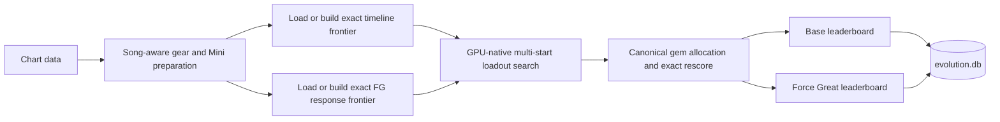

<div align="center">

# RoBeats MetaFinder

**GPU-first loadout optimization and exact score modeling for RoBeats.**


MetaFinder searches gear, Minis, gems, fever timing, and Force Great strategies, then stores separate Base and Force Great leaderboards for every processed chart.

[Quick start](#quick-start) · [How it works](#how-it-works) · [Commands](#commands) · [Documentation](#documentation)

</div>

> [!IMPORTANT]
> MetaFinder preserves exact integer scoring, floor operations, ordering, ties, witnesses, timing-frontier semantics, and modeled input-engine reachability. The **outer gear/Mini search is a multi-start GPU genetic search**, so a result is the best solution found under the configured search budget—not a mathematical proof that no better loadout exists.

## What MetaFinder does

| Area | Current production behavior |
|---|---|
| **Loadout search** | GPU-native multi-start search over six gear slots and three Mini slots, with deterministic persistence and warm starts from prior results. |
| **Base timing** | Builds and caches the exact non-dominated fever-timing frontier instead of selecting from a small set of guessed timelines. |
| **Force Greats** | Uses one canonical exact response-frontier scorer; obsolete manual and alternate FG modes are rejected. |
| **Physical reachability** | Accounts for lane identity, chart order, legal Perfect/Great timing, half-fill Greats, section placement, and ordered witnesses when constructing reachable FG surfaces. |
| **Score math** | Preserves per-note integer floors, combo order, Fever membership, Great penalties, head-note masks, and body counts. |
| **Mini Ascension** | Materializes maxed Mini Ascension stats per song, including universal Perfect Points and song-targeted elemental bonuses. |
| **Persistence** | Stores separate Base and Force Great results in SQLite and reuses compatible results and exact frontier caches across runs. |
| **Website integration** | Includes a stateless HTTP optimizer service for official charts and uploaded custom charts. |

### Accuracy boundary

MetaFinder is designed around the canonical **full-combo** optimization surface. Exact scoring does not turn the outer genetic search into an exhaustive loadout proof, and deliberate Okay/Miss/combo-break strategies are not silently treated as supported search actions.

The project also has no CPU production fallback. CPU implementations and the faithful game simulator exist for reference, differential testing, and oracle verification; production optimization is GPU-first.

## How it works



1. The app discovers the chart, gear, Mini, and Stats data.
2. Song-specific state is materialized, including Mini Ascension effects.
3. Exact timeline and Force Great frontier payloads are loaded from compatible caches or built once.
4. The Taichi/Vulkan engine searches candidate loadouts while CPU preparation, decode, post-processing, and database work overlap through the native in-flight scheduler.
5. Canonical results are written to `evolution.db` with Base and Force Great leaderboards kept separate.

## Quick start

### Requirements

- Python **3.10 or newer**
- A working **Vulkan-capable GPU** and current graphics driver
- Enough system memory and disk space for JIT output and persistent frontier caches

The maintained production target is Taichi on `ti.vulkan`. CPU-only environments can run reference tests, but not the production optimizer path.

### Install

```bash
git clone https://github.com/TheBaconactor/RoBeats-Calculator-Engine.git
cd RoBeats-Calculator-Engine

python -m venv .venv
```

Activate the environment:

```powershell
# Windows PowerShell
.\.venv\Scripts\Activate.ps1
```

```bash
# Linux/macOS shell
source .venv/bin/activate
```

Install the pinned runtime dependencies:

```bash
python -m pip install --upgrade pip
python -m pip install -r requirements.txt
```

Development and test dependencies are separate:

```bash
python -m pip install -r requirements-dev.txt
```

### Configure the target

The root `config.ini` intentionally exposes only the normal song-selection surface:

```ini
[CalculateSong]
Song_Name =
Difficulty =
TargetPrimary = All
TargetSecondary = All
LoopForever = false
```

- Set `Song_Name` to target one chart by its exact catalog identity.
- Leave `Song_Name` blank to scan the matching queue.
- Use `Difficulty`, `TargetPrimary`, and `TargetSecondary` to narrow the queue.
- Set `LoopForever = true` only when continuous queue processing is intended.
- Override the config path with `METAFINDER_CONFIG_PATH=/path/to/config.ini`.

Production scoring modes are not user-selectable compatibility switches. The exact timeline frontier and exact FG response frontier are the canonical paths.

### Run

```bash
python main.py
```

Safe shutdown:

- Press `Ctrl+C` once to request a graceful stop after current work and database flushes.
- Press `Ctrl+C` again to force termination.
- Create `bin/STOP` to request a stop from another process. Override that path with `METAFINDER_STOP_FILE`.

## Data and generated state

```text
RoBeats-Calculator-Engine/
├── Data/
│   ├── Easy/ Normal/ Hard/          # Official chart files
│   ├── Gear/                        # Gear and Mini source tables
│   └── exported_game_data.json      # Optional source for CSV regeneration
├── gear_optimizer/                  # Optimizer package
├── tests/                           # CPU, GPU, parity, and regression coverage
├── tools/                           # Maintained verification and maintenance tools
├── scripts/                         # Ad-hoc profiling and research scripts
├── docs/                            # Architecture, math, decisions, and operating notes
├── evolution.db                     # Canonical result database
├── bin/                             # Caches, logs, profiles, and run state
└── artifacts/                       # Generated reports and exports
```

Important generated paths:

| Path | Purpose |
|---|---|
| `evolution.db` | Canonical Base and Force Great leaderboards. |
| `bin/timeline_frontier_cache/` | Persistent exact fever-timeline frontier payloads. |
| `bin/fg_response_frontier_cache/` | Persistent exact Force Great response-frontier payloads. |
| `bin/paths_cache.json` | Auto-discovered data paths. |
| `bin/error.log` | Durable runtime diagnostics. |
| `artifacts/` | Generated analysis and export output. |

Cache fingerprints include semantic inputs. When scoring logic, timing inputs, lane data, or cache formats change, incompatible entries are rejected and rebuilt rather than relabeled as valid.

## Commands

### Optimizer and data commands

```bash
# Normal optimizer run
python main.py
# Equivalent module command
python -m gear_optimizer.cli run

# Cross-song GeneralMeta analysis
python -m gear_optimizer.cli meta

# Regenerate gear and Mini CSV data from exported_game_data.json
python -m gear_optimizer.cli sync-data
```

### Maintained tools

```bash
# Discover maintained tools and scripts
python -m tools list

# Show inventory and clutter hotspots
python -m tools audit

# Run one discovered tool by ID
python -m tools run tools:db/check_db
python -m tools run scripts:query/query_top_loadouts -- --help
```

### Optimizer HTTP service

```bash
python -m gear_optimizer.robeatsmeta_service --host 127.0.0.1 --port 8765
```

The service exposes:

- `GET /songs` — official chart metadata
- `POST /optimize` — isolated optimization for an official chart or supplied chart text

It binds to loopback by default. Set `ROBEATSMETA_OPTIMIZER_API_TOKEN` before exposing it outside a trusted local environment, and place any public deployment behind TLS and an appropriate reverse proxy. Request solves use isolated working directories while sharing canonical compatible frontier caches.

## Architecture

| Layer | Primary ownership |
|---|---|
| Application | [`gear_optimizer/app.py`](gear_optimizer/app.py), CLI startup, graceful shutdown, queue ownership |
| Scheduling | [`gear_optimizer/solver/native_inflight_orchestrator.py`](gear_optimizer/solver/native_inflight_orchestrator.py), overlapping CPU/GPU stages |
| Search | [`gear_optimizer/solver/genetic.py`](gear_optimizer/solver/genetic.py), GPU-native multi-start candidate search |
| Exact timing | [`gear_optimizer/solver/timeline_exact_frontier.py`](gear_optimizer/solver/timeline_exact_frontier.py), packed non-dominated fever surfaces |
| Force Greats | [`gear_optimizer/solver/taichi_gem/force_greats/`](gear_optimizer/solver/taichi_gem/force_greats/), exact response-frontier construction and scoring |
| Score verification | [`gear_optimizer/solver/scoring/`](gear_optimizer/solver/scoring/), integer exact rescoring and parity paths |
| Data | [`gear_optimizer/data/`](gear_optimizer/data/), ingest, Mini Ascension, SQLite persistence, migrations |
| Integration | [`gear_optimizer/robeatsmeta_service.py`](gear_optimizer/robeatsmeta_service.py), stateless website-facing solve service |

The repository enforces a single canonical production implementation per semantic behavior: no song exceptions, silent degraded modes, or old/new compatibility switches in internal optimizer logic.

## Testing and quality gates

```bash
# CPU/reference suite
python -m pytest -m "not gpu" tests/

# Vulkan-facing suite
python -m pytest -m gpu tests/

# Lint
python -m ruff check .

# Repository quality gate on Windows
powershell -ExecutionPolicy Bypass -File tools/dev/quality_check.ps1
```

GPU, timing, cache, or physical-reachability changes require Vulkan-facing and oracle/parity evidence. Documentation-only changes normally do not require the full GPU suite.

## Troubleshooting

<details>
<summary><strong>Data paths are not discovered</strong></summary>

Delete `bin/paths_cache.json`, verify the required `Data/` files exist, and run `python main.py` again.

</details>

<details>
<summary><strong>Taichi cannot initialize Vulkan</strong></summary>

Update the GPU driver and verify the pinned Taichi installation can initialize Vulkan:

```bash
python -c "import taichi as ti; ti.init(arch=ti.vulkan); print('Vulkan ready')"
```

The production optimizer intentionally does not fall back to CPU scoring.

</details>

<details>
<summary><strong>The first run appears much slower</strong></summary>

A cold run may compile Numba/Taichi code and build missing exact timeline or FG frontier caches. Compatible later runs reuse the persisted artifacts. Do not delete `bin/numba_cache/`, `bin/timeline_frontier_cache/`, or `bin/fg_response_frontier_cache/` unless troubleshooting or intentionally forcing a rebuild.

</details>

<details>
<summary><strong>A cache rebuild starts after an update</strong></summary>

That is expected when the semantic fingerprint or cache format changes. Never rename or manually relabel an older cache generation as compatible; rebuild it through the canonical producer.

</details>

<details>
<summary><strong>The optimizer service runs out of memory</strong></summary>

The service gates concurrent solve starts using available memory, but the configured pool may still be too aggressive for the host. Reduce `ROBEATSMETA_OPTIMIZER_SERVICE_POOL`, leave the memory admission guard enabled, and pre-provision compatible frontier caches on a larger machine when appropriate.

</details>

## Documentation

Start here:

- [`docs/README.md`](docs/README.md) — documentation index
- [`docs/NAVIGATION.md`](docs/NAVIGATION.md) — current file-level code map
- [`docs/ENGINEERING_PRINCIPLES.md`](docs/ENGINEERING_PRINCIPLES.md) — canonical engineering doctrine
- [`docs/Implementation Records/TIMING_ENVELOPE_EXACT_FRONTIER.md`](docs/Implementation%20Records/TIMING_ENVELOPE_EXACT_FRONTIER.md) — exact timing-frontier model
- [`docs/Implementation Records/INPUT_ENGINE_AWARE_FEVER_REACHABILITY.md`](docs/Implementation%20Records/INPUT_ENGINE_AWARE_FEVER_REACHABILITY.md) — input-engine reachability design and evidence
- [`docs/Implementation Records/MINI_ASCENSION_OPTIMIZER_SCORING.md`](docs/Implementation%20Records/MINI_ASCENSION_OPTIMIZER_SCORING.md) — song-aware Mini Ascension scoring
- [`docs/DATABASE_SCHEMA.md`](docs/DATABASE_SCHEMA.md) — persistence schema
- [`AGENTS.md`](AGENTS.md) — repository-wide contributor and agent rules

Implementation records preserve design decisions and validation history. They are not a substitute for the current production code or the navigation guide when older sections describe superseded intermediate states.

## Contributing

Before submitting a change:

1. Read [`AGENTS.md`](AGENTS.md) and the nearest subtree-specific `AGENTS.md`.
2. Fix the owning invariant rather than adding a fallback or song-specific exception.
3. Keep Base and Force Great outputs separate.
4. Add the narrowest tests that prove the change; include Vulkan-facing coverage for GPU behavior.
5. Run the applicable lint, test, and repository quality gates.

Behavior or policy changes require an implementation record and a `docs/CODEX_WORKLOG.md` entry.

## Security

Never commit API tokens, credentials, private chart uploads, or deployment secrets. The optimizer HTTP service is intended to sit behind a trusted boundary and optional bearer-token authentication; loopback binding is the safe default.

## License

Personal use only. All rights reserved.
