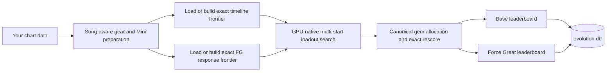
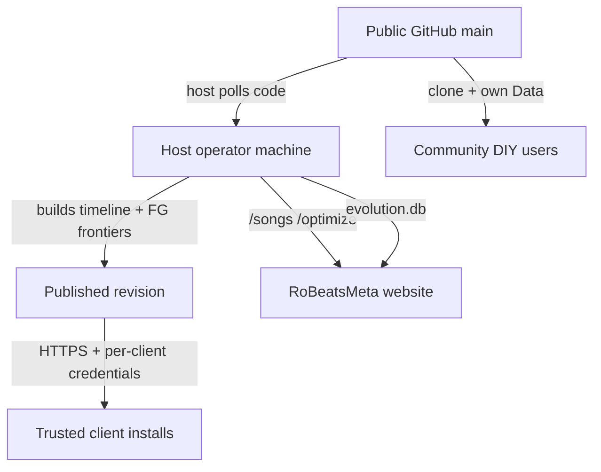

<div align="center">

# RoBeats Song Optimizer

**Exact score modeling and GPU-native loadout search for RoBeats charts.**


Search gear, Minis, gems, fever timing, and Force Great strategies with integer-exact scoring, then persist separate Base and Force Great leaderboards per chart.

[Quick start](#quick-start) · [Deployment models](#deployment-models) · [Data setup](DATA.md) · [Documentation](#documentation)

</div>

> **Community tool — not affiliated with RoBeats, Roblox, or any game publisher.** Chart and gear data are not shipped in this repository. See [DATA.md](DATA.md) and [Deployment models](#deployment-models) below.

> [!IMPORTANT]
> The optimizer preserves exact integer scoring, floor operations, ordering, ties, witnesses, timing-frontier semantics, and modeled input-engine reachability. The **outer gear/Mini search is a multi-start GPU genetic search**, so a result is the best solution found under the configured search budget—not a proof that no better loadout exists.

## Capabilities

| Area | Production behavior |
|---|---|
| **Loadout search** | GPU-native multi-start search over six gear slots and three Mini slots, with deterministic persistence and warm starts from prior results. |
| **Base timing** | Builds and caches the exact non-dominated fever-timing frontier instead of selecting from a small set of guessed timelines. |
| **Force Greats** | One canonical exact response-frontier scorer; obsolete manual and alternate FG modes are rejected. |
| **Physical reachability** | Lane identity, chart order, legal Perfect/Great timing, half-fill Greats, section placement, and ordered witnesses when constructing reachable FG surfaces. |
| **Score math** | Per-note integer floors, combo order, Fever membership, Great penalties, head-note masks, and body counts. |
| **Mini Ascension** | Materializes maxed Mini Ascension stats per song, including universal Perfect Points and song-targeted elemental bonuses. |
| **Persistence** | Separate Base and Force Great results in SQLite; reuses compatible results and exact frontier caches across runs. |
| **HTTP service** | Stateless optimizer API for official charts and uploaded custom charts (used by [RoBeatsMeta](https://robeatsmeta.net) and self-hosted deployments). |

Exact scoring does not make the outer genetic search exhaustive, and deliberate Okay/Miss/combo-break strategies are not treated as supported search actions. Production optimization is **GPU-first** on Taichi/Vulkan; CPU paths exist for reference, differential testing, and oracle verification only.

## How it works



1. Discover chart, gear, Mini, and Stats paths under your local `Data/` tree.
2. Materialize song-specific state, including Mini Ascension effects.
3. Load or build exact timeline and Force Great frontier payloads from compatible caches.
4. Run the Taichi/Vulkan search while CPU preparation, decode, post-processing, and database work overlap.
5. Write canonical results to `evolution.db` with Base and Force Great leaderboards kept separate.

## Deployment models

Three supported ways to run the optimizer. Pick the one that matches your role.



### 1. Host operator (authoritative builder + publisher)

The production deployment behind [RoBeatsMeta](https://robeatsmeta.net). **One machine** owns canonical frontier construction and publication.

| Responsibility | Detail |
|---|---|
| Code source | Polls public GitHub `main` (or a pinned ref) into a clean host checkout |
| Frontier builds | Only the host builds timeline and Force Great frontiers for the published catalog |
| Publication | Atomically publishes code + Data + frontier caches at `https://api.robeatsmeta.net/metafinder/v1` |
| Website service | Runs `gear_optimizer.robeatsmeta_service` — `/songs`, `/optimize`, and the distribution API |
| Credentials | Issues and revokes per-installation client credentials via `gear_optimizer.frontier_auth` |
| Database | Keeps `evolution.db` external to git (`METAFINDER_EVOLUTION_DB`); feeds the website build pipeline |

Host-side frontier sync is **disabled** in service mode (`ROBEATSMETA_OPTIMIZER_SERVICE_MODE=1`). Clients never pull raw GitHub for frontiers — they receive the host's published revision.

After OSS, the host continues as today. Point `ROBEATSMETA_FRONTIER_GIT_REMOTE` / `ROBEATSMETA_FRONTIER_GIT_BRANCH` at the public repository; local `Data/` and `evolution.db` stay on the machine and out of git.

### 2. Trusted clients (GitHub install + hosted sync)

Installations that receive managed code, chart Data, and prebuilt frontiers from the host operator.

1. Clone from GitHub (initial install marker and managed-file inventory).
2. Receive `bin/frontier_client_credentials.json` from the host operator (never commit).
3. On each startup, authenticate to `https://api.robeatsmeta.net/metafinder/v1`, install changed code bundles, then Data/frontier bundles with SHA-256 verification.

**Frontier credentials are required** for this model. Without them, startup skips hosted sync (see persona 3).

| Variable | Default | Purpose |
|---|---|---|
| `METAFINDER_FRONTIER_SERVER_URL` | `https://api.robeatsmeta.net/metafinder/v1` | Hosted update origin (HTTPS required off loopback) |
| `METAFINDER_FRONTIER_CREDENTIALS_FILE` | `bin/frontier_client_credentials.json` | Per-install client credential |

Issue or revoke credentials on the host:

```bash
python3 -m gear_optimizer.frontier_auth issue <client-id> /secure/path/frontier_client_credentials.json
python3 -m gear_optimizer.frontier_auth revoke <client-id>
```

Transfer the credential file securely (`chmod 600` on POSIX).

### 3. Community DIY users (GitHub clone + your own data)

For contributors and independent users who do not participate in the hosted distribution channel.

1. Clone from GitHub and install Python dependencies.
2. Populate `Data/` with your own charts and gear tables — see [DATA.md](DATA.md).
3. Copy `config.ini.example` to `config.ini` and run `python main.py`.

**Frontier auth is optional** for this persona. When `bin/frontier_client_credentials.json` is absent, startup skips hosted sync and uses your local checkout and local `Data/` unchanged. You build any required frontiers locally on your own GPU.

This is the intended path for open-source contributors. It is not the RoBeatsMeta production distribution model.

## Quick start

### Requirements

- Python **3.10+**
- A **Vulkan-capable GPU** and current graphics driver
- Disk space for JIT output, frontier caches, and your local `Data/` tree

### Install

```bash
git clone https://github.com/TheBaconactor/RoBeats-Calculator-Engine.git robeats-song-optimizer
cd robeats-song-optimizer

python -m venv .venv
source .venv/bin/activate   # Windows: .\.venv\Scripts\Activate.ps1

python -m pip install --upgrade pip
python -m pip install -r requirements.txt
```

Development and test dependencies: `python -m pip install -r requirements-dev.txt`

### Provide data (DIY users)

The public repository ships **code only**. If you are a community DIY user, populate `Data/` before your first run — see **[DATA.md](DATA.md)**.

Trusted clients receive Data from the host via frontier sync. Host operators maintain Data locally (untracked).

```bash
cp config.ini.example config.ini
# Edit Song_Name, Difficulty, and queue filters
```

### Run

```bash
python main.py
```

Graceful shutdown: `Ctrl+C` once (flush and stop), twice (force exit), or create `bin/STOP` (`METAFINDER_STOP_FILE` to override).

## Repository layout

```text
robeats-song-optimizer/
├── gear_optimizer/          # Optimizer package
├── tests/                   # CPU, GPU, parity, and regression coverage
├── tools/                   # Verification and maintenance tools
├── docs/                    # Architecture, math, and implementation records
├── Data/                    # User-supplied charts and gear (not in git)
├── config.ini               # Local target selection (copy from config.ini.example)
├── evolution.db             # Generated results (not in git)
├── bin/                     # Caches, logs, run state (not in git)
└── artifacts/               # Generated reports (not in git)
```

## Commands

```bash
python main.py                              # Optimizer run
python -m gear_optimizer.cli run            # Same, via module
python -m gear_optimizer.cli meta           # Cross-song GeneralMeta analysis
python -m gear_optimizer.cli sync-data        # Regenerate Gear CSVs from exported_game_data.json

python -m tools list                        # Discover maintained tools
python -m tools run tools:db/check_db       # Example tool invocation

python -m gear_optimizer.robeatsmeta_service --host 127.0.0.1 --port 8765
```

### Optimizer HTTP service

Used by the **host operator** for website integration and by self-hosted deployments.

Endpoints:

- `GET /songs` — official chart metadata from the service's published `Data/` snapshot
- `POST /optimize` — isolated optimization for an official chart or supplied chart text
- `GET /metafinder/v1/manifest` and bundle downloads — authenticated frontier distribution to trusted clients

Bind to loopback by default. Set `ROBEATSMETA_OPTIMIZER_API_TOKEN` before exposing the service outside a trusted environment.

Host-side configuration (unchanged after OSS):

| Variable | Purpose |
|---|---|
| `ROBEATSMETA_OPTIMIZER_SERVICE_MODE` | Set on the host service to disable client-side frontier sync |
| `ROBEATSMETA_FRONTIER_CLIENTS_FILE` | Host-side client registry (`bin/frontier_server_clients.json`) |
| `ROBEATSMETA_FRONTIER_GIT_REMOTE` / `ROBEATSMETA_FRONTIER_GIT_BRANCH` | Git ref the host polls before publication (public `main` after OSS) |
| `ROBEATSMETA_FRONTIER_GIT_POLL_SECONDS` | Host refresh interval (default 300) |
| `METAFINDER_EVOLUTION_DB` | External evolution database path for website pipeline |
| `ROBEATSMETA_OPTIMIZER_REPO_ROOT` | Optimizer checkout path (RoBeatsMeta sibling layout) |

See [Deployment models](#deployment-models) for host vs trusted-client vs DIY setup.

## Architecture

| Layer | Primary ownership |
|---|---|
| Application | [`gear_optimizer/app.py`](gear_optimizer/app.py) — CLI startup, shutdown, queue |
| Scheduling | [`gear_optimizer/solver/native_inflight_orchestrator.py`](gear_optimizer/solver/native_inflight_orchestrator.py) |
| Search | [`gear_optimizer/solver/genetic.py`](gear_optimizer/solver/genetic.py) |
| Exact timing | [`gear_optimizer/solver/timeline_exact_frontier.py`](gear_optimizer/solver/timeline_exact_frontier.py) |
| Force Greats | [`gear_optimizer/solver/taichi_gem/force_greats/`](gear_optimizer/solver/taichi_gem/force_greats/) |
| Score verification | [`gear_optimizer/solver/scoring/`](gear_optimizer/solver/scoring/) |
| Data | [`gear_optimizer/data/`](gear_optimizer/data/) |
| Integration | [`gear_optimizer/robeatsmeta_service.py`](gear_optimizer/robeatsmeta_service.py) |

One canonical production implementation per semantic behavior — no song exceptions or internal compatibility switches.

## Testing

```bash
python -m pytest -m "not gpu" tests/    # CPU/reference suite
python -m pytest -m gpu tests/          # Vulkan-facing suite
python -m ruff check .
```

GPU, timing, cache, or reachability changes need Vulkan-facing and oracle evidence.

## Troubleshooting

<details>
<summary><strong>Data paths are not discovered</strong></summary>

Delete `bin/paths_cache.json`, verify `Data/` matches [DATA.md](DATA.md), and run again.

</details>

<details>
<summary><strong>Taichi cannot initialize Vulkan</strong></summary>

Update the GPU driver, then:

```bash
python -c "import taichi as ti; ti.init(arch=ti.vulkan); print('Vulkan ready')"
```

</details>

<details>
<summary><strong>First run is much slower</strong></summary>

Cold runs compile Numba/Taichi kernels and may build missing exact frontiers. Later runs reuse persisted caches under `bin/`.

</details>

## Documentation

- [`docs/README.md`](docs/README.md) — documentation index
- [`docs/NAVIGATION.md`](docs/NAVIGATION.md) — file-level code map
- [`docs/ENGINEERING_PRINCIPLES.md`](docs/ENGINEERING_PRINCIPLES.md) — engineering doctrine
- [`DATA.md`](DATA.md) — user-supplied data setup
- [`CONTRIBUTING.md`](CONTRIBUTING.md) — contribution guidelines
- [`AGENTS.md`](AGENTS.md) — agent and contributor rules

## Security

Do not commit API tokens, frontier credentials, private chart uploads, or deployment secrets. The HTTP service belongs behind a trusted boundary; loopback binding is the safe default.

## License

[Apache License 2.0](LICENSE)
