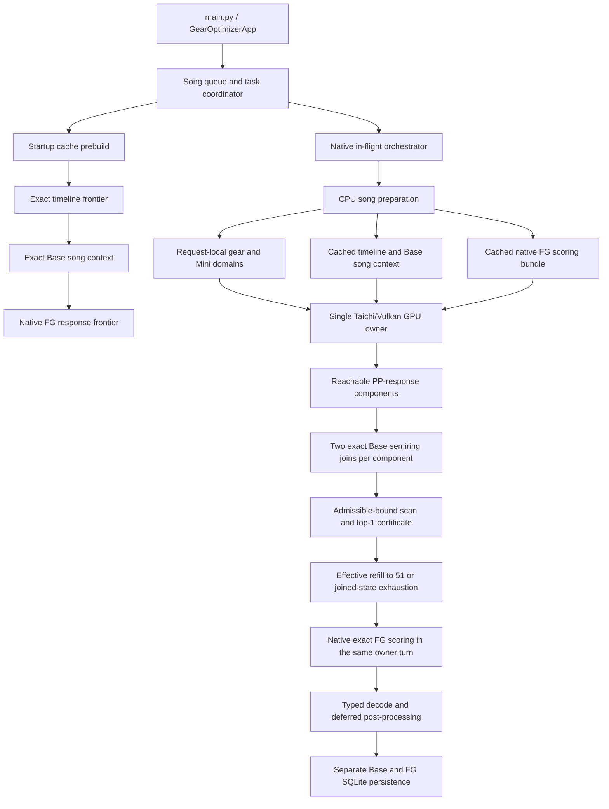

# Gear Optimizer Architecture

> [!NOTE]
> This is the current production architecture. For the file-level map, see
> [NAVIGATION.md](NAVIGATION.md). Historical decisions remain in
> [Implementation Records](Implementation%20Records/README.md).

## Production Contract

MetaFinder has one GPU-first optimization path:

1. build request-local gear and Mini domains;
2. certify the globally optimal Base loadout with the exact Vulkan semiring search;
3. deterministically refill, rank, and retain up to 51 effective loadouts from the exact-scored
   witness pool, stopping earlier only when all joined states are exhausted;
4. score that surface with the native exact Force Greats solver; and
5. persist Base and Force Great winners to their separate leaderboards.

The global certificate covers Base top-1. The up-to-51-loadout funnel is not a global Base top-51
certificate; native FG is exact for each retained candidate. The outer search has no stochastic
budget, incumbent dependency, catalog frontier, or CPU production fallback. Catalogs that violate
a required input invariant fail explicitly. The supported objective remains the modeled
full-combo scoring surface; deliberate combo breaks, Okay, and Miss actions are outside that
contract.

## Runtime Flow



The native in-flight scheduler overlaps CPU preparation, GPU-owner work, decode, and database
post-processing across songs. A song slot is held only for its fused exact Base plus native FG
owner request. Taichi/Vulkan ownership remains single-threaded even while host stages overlap.

## Exact Base Search

The Base solver is divided by ownership, not by alternative algorithms:

- `solver/exact_base_domains.py` enumerates legal three-slot gear products and distinct unordered
  Mini triples from the current request, then losslessly reduces fixed-timing prefixes. It
  partitions Mini triples by exact PP total and completed PP states by their exact
  PP-gem/overflow response profile, emitting only reachable scalar components.
- `solver/exact_base_song_context.py` converts a song's exact timing frontier into timing-response
  antichains, dense program classes, and admissible multiplier bounds.
- `solver/taichi_gem/kernels/exact_base_semiring.py` performs the gear join and the gear-plus-Mini
  join on Vulkan, preserving witnesses for reconstructing legal loadouts.
- `solver/exact_base_search.py` scans candidates in descending admissible-bound order, scores the
  necessary witnesses exactly in every reachable component, and stops only after no unscored
  state can beat the incumbent. It then continues from the highest remaining bounds when needed
  to obtain 51 effective candidates, or until all joined states are exhausted.
- `solver/exact_base_candidate_surface.py` applies canonical effective-loadout deduplication,
  deterministic Base ranking of the exact-scored witness pool, exact row materialization, and the
  up-to-51-loadout FG funnel limit.

The catalog domains are request-local and cheap to rebuild when the website supplies custom gear
or Minis. A request that reaches one response component keeps the one-component hot path exercised
by the default-catalog `00 (Hard)` benchmark. Other official or custom requests, including catalogs
with nonuniform Mini PP totals or PP-gem-optimal allocations, pay only for the
`(Mini PP total, response profile)` components reachable by that request. These components are
deliberately not part of any prebuilt per-catalog frontier; song-only scoring context is reusable
across catalog changes.

## Native Force Greats Handoff

`solver/native_fg_owner.py` consumes the typed seven-component Base statistics for the ranked
surface and invokes the native response-frontier scorer directly on the GPU owner. The handoff
does not launch a second outer search and does not reinterpret Base rank as an FG result.

`solver/exact_base_pipeline_decode.py` receives aligned typed arrays from
`ExactBasePipelineResult`, emits `LoadoutIDs`, and obtains the nine-item `Loadout` from the item
registry. No packed or stochastic-search candidate schema crosses the pipeline boundary.

Base and FG remain separate product results:

- Base ranking uses exact Base score and writes `songs.best_score`.
- FG ranking uses native exact FG score and writes `songs.best_fg_score`.

## Cache Ownership

Startup verifies or builds three catalog-independent cache families in dependency order:

1. `timeline_frontier_cache`: exact fever-timing payloads;
2. `exact_base_song_context_cache`: Base timing-response/program data derived from the timeline;
3. `fg_response_frontier_cache`: native Force Great response-frontier payloads.

Cache identities are semantic and versioned. Paths, benchmark names, gear, and Minis do not define
the exact Base song-context key. Missing or incompatible generations are cache misses and must be
built by the canonical producer; a corrupt artifact at the current key fails loudly. Explicitly
compatible caches can be copied between worktrees and reused.

Request-local catalog memoization is separately content-addressed. Stable fingerprints include
gear/Mini order, names, slots, and nested stat values, so an in-place mutation of a reused website
catalog invalidates the dependent pruned pool, item registry, Mini-equivalence map, and effective
dedupe tables.

When multiple Base contexts are missing, startup divides them into caller-owned spawn generations.
Each generation is capped at eight tasks per worker and uses a rolling pending queue capped at two
tasks per worker. The caller drains every future and exits that generation's executor before
creating the next one. Keeping generation ownership outside submission avoids the Windows
queue-manager deadlock caused by recycling from inside the submit loop; ending each bounded worker
lifetime also releases native/NumPy allocator commit instead of letting it ratchet upward in a
never-ending pool. A single missing context is built in-process.

## Layer Ownership

| Layer | Responsibility |
|---|---|
| `gear_optimizer/core/` | Config, environment parsing, constants, paths, process/runtime setup |
| `gear_optimizer/data/` | CSV input, SQLite schema and persistence, domain data models |
| `gear_optimizer/pipeline/` | Song queue coordination, post-processing, result persistence handoff |
| `gear_optimizer/solver/` | Exact Base, native FG, scoring math, caches, GPU ownership and scheduling |
| `gear_optimizer/solver/taichi_gem/` | Taichi/Vulkan fields, APIs, exact kernels and device lifecycle |
| `gear_optimizer/helpers/` | Shared pure transformations and per-song presentation helpers |

Dependencies should point downward from app/orchestration to these owners. Scoring formulas, GPU
contracts, persistence rules, and config parsing must not be cloned into convenience helpers.

## Failure Boundaries

Internal optimizer invariants fail loudly. In particular, production does not switch to another
solver when exact domain assumptions, cache integrity, Vulkan availability, song-slot ownership,
candidate shape, or Base-to-FG coverage is invalid. Recovery is reserved for real external
boundaries such as malformed user input or filesystem/service failures where the caller can make a
meaningful decision.

## Verification

Use the narrowest proof appropriate to a change:

```powershell
python -m ruff check .
python -m pytest -m "not gpu" tests/
python -m pytest -m gpu tests/
powershell -ExecutionPolicy Bypass -File tools/dev/quality_check.ps1
```

Exact Base or Taichi changes require a Vulkan-facing test. Pipeline changes should also exercise
the fused Base-to-FG owner lifecycle and separate persistence results.
