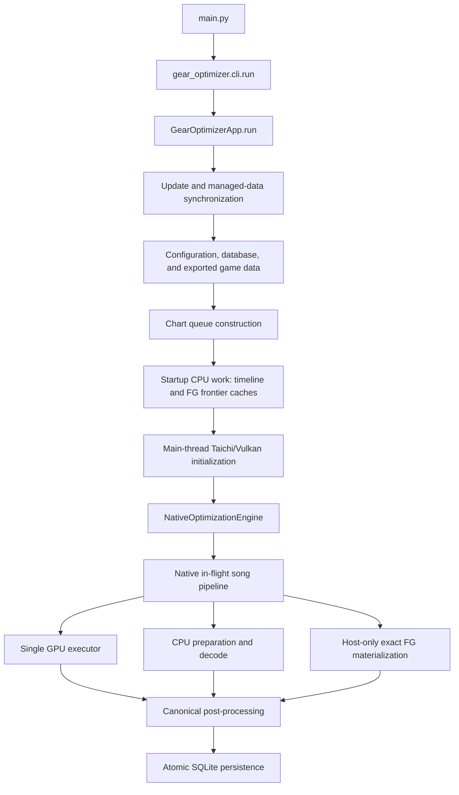
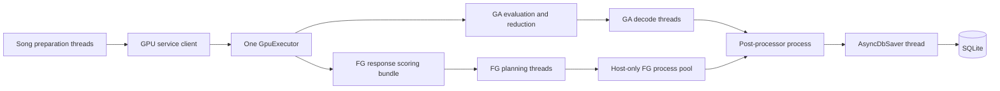
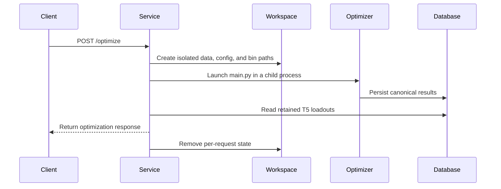

# Architecture

RoBeats Calculator Engine is a GPU-first optimization system with explicit
ownership boundaries for search, exact scoring, Force Great planning, and
persistence. This page follows the current production code. For a file-oriented
index, see [NAVIGATION.md](NAVIGATION.md).

## Runtime surfaces

The repository has two supported runtime surfaces:

- the command-line optimizer, which runs a selected chart queue; and
- the HTTP service, which isolates each optimization request and launches the
  command-line optimizer in a child process.

The outer genetic search is heuristic and budget-bounded. Exactness claims apply
to evaluation of supported score and timing surfaces and to canonical rescore,
not to exhaustive enumeration of every possible loadout.

## Command-line optimizer

`GearOptimizerApp._run_single_iteration()` owns startup ordering:

1. synchronize the client and optional managed frontier data;
2. load configuration, resolve paths, and apply the memory guard;
3. initialize SQLite and synchronize exported game data;
4. load stats, gear, minis, and the selected chart queue;
5. build or verify timeline and Force Great response-frontier caches;
6. initialize Taichi/Vulkan on the main thread; and
7. hand canonical task tuples to `NativeOptimizationEngine`.

Taichi initialization happens before worker scheduling because the device
runtime is process-global and must have one unambiguous owner.

## In-flight execution and ownership

`gear_optimizer/solver/native_inflight_orchestrator.py` overlaps work across
songs while preserving a single device owner.

The main execution owners are:

- `gear_optimizer/solver/native_inflight_lifecycle.py` for resources,
  preparation, progress, and shutdown;
- `gear_optimizer/solver/native_inflight_pipeline.py` and
  `native_inflight_pipeline_ga.py` for GA request and decode stages;
- `gear_optimizer/solver/native_inflight_pipeline_fg.py` for Force Great
  planning and host-only payload materialization;
- `gear_optimizer/solver/gpu_service.py` for the orchestration-to-device
  request boundary; and
- `gear_optimizer/solver/gpu_executor.py` for all mutable GPU execution.

Song-level parallelism uses in-flight scheduling in one optimizer process.
Preparation and decode use thread pools. `NativeFGPipeline` uses a small spawned
process pool for CPU-only exact payload materialization; those workers never
initialize or access the GPU.

## Search, scoring, and Force Great frontiers

### Genetic search

- `gear_optimizer/solver/genetic_pipeline.py` constructs native GA requests.
- `gear_optimizer/solver/genetic_pipeline_decode.py` decodes retained device
  results.
- `gear_optimizer/solver/taichi_gem/api/` is the public Taichi solver surface.
- `gear_optimizer/solver/taichi_gem/kernels/` contains device kernels.

Production scoring imports through the public Taichi API or GPU service rather
than reaching into kernel internals.

### Exact score and timing authority

- `gear_optimizer/solver/scoring/` owns integer score evaluation and canonical
  rescore.
- `gear_optimizer/solver/fever_timeline.py` owns Fever timeline semantics.
- `gear_optimizer/solver/timeline_exact_frontier.py` constructs exact,
  non-dominated timing surfaces.
- `gear_optimizer/solver/timing_envelope.py` applies the selected timing model.

CPU exact scoring is a production canonicalization boundary as well as a parity
oracle. It is not a silent recovery path for failed GPU execution.

### Force Great ownership

Force Great behavior is split by responsibility:

- `gear_optimizer/solver/fg_response_scoring/` owns high-level planning,
  reduction, replay, and service contracts;
- `gear_optimizer/solver/taichi_gem/force_greats/response_frontier.py` owns the
  device response-frontier implementation and related response modules;
- `gear_optimizer/solver/fg_response_frontier_cache_prebuild.py` owns startup
  cache construction; and
- `gear_optimizer/solver/scoring/` owns canonical exact rescore of retained
  Force Great results.

Response-frontier identity includes the chart and score semantics that can
change a result. A missing or incompatible exact surface is an error.

## Post-processing and persistence

`gear_optimizer/pipeline/post_processor.py` runs in a separate process. It
canonicalizes retained Base and Force Great results before passing persistence
work to `AsyncDbSaver`.

The database boundary is:

- `gear_optimizer/data/database/connection.py` for path resolution and schema
  initialization;
- `gear_optimizer/data/database/leaderboards.py` for seed and leaderboard
  reads;
- `gear_optimizer/data/database/persistence.py` for transactional writes; and
- `gear_optimizer/data/migrations/` for schema definition and validation.

The package facade is `gear_optimizer.data.database`. Base and Force Great
leaderboards have separate ranking authority and separate tables.
`save_optimizer_song_result()` commits a processed song's retained entries and
attempt counters atomically.

## HTTP service

`gear_optimizer/robeatsmeta_service.py` exposes the supported service boundary:

- `GET /songs` returns the available chart catalog;
- `POST /optimize` runs an official or supplied chart; and
- `/metafinder/v1/*` serves optional authenticated distribution metadata.

Non-loopback binding requires `ROBEATSMETA_OPTIMIZER_API_TOKEN`. Each solve gets
isolated data, configuration, binary-state, and database paths so concurrent
requests cannot share mutable optimizer state.

## Core invariants

1. **One GPU owner:** orchestration submits requests; worker threads and child
   processes do not mutate Taichi/Vulkan state.
2. **Exact visible scores:** retained results pass canonical integer and timing
   rescore before persistence.
3. **Separate objectives:** Base ranking uses `score`; Force Great ranking uses
   `fg_score`.
4. **Semantic cache identity:** any chart or solver semantic that changes a
   frontier changes its cache identity.
5. **Atomic persistence:** a processed song's retained results and attempt
   counters commit together.
6. **Isolated service jobs:** request-specific files and databases never reuse
   another request's mutable workspace.
7. **Fail loudly:** malformed score payloads, missing exact surfaces,
   incompatible schemas, and GPU failures do not produce plausible fallback
   results.

## Verification layers

- CPU tests cover scoring, timeline, configuration, and data contracts.
- GPU-marked tests cover Taichi/Vulkan parity, ownership, and execution.
- `tests/test_repo_guardrails.py` checks removed surfaces, sensitive exports,
  documentation links and code paths, config examples, and GitHub math syntax.
- Maintained benchmarks under `tools/bench/` measure performance; they do not
  redefine correctness.
