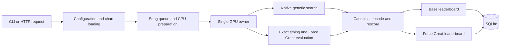

# Architecture

RoBeats Calculator Engine is a GPU-first optimizer with exact scoring,
timing-frontier, and persistence boundaries. This page describes the current
production path. For individual files, see [NAVIGATION.md](NAVIGATION.md).

## Runtime overview

The primary command-line path is `main.py` → `gear_optimizer.cli.run()` →
`GearOptimizerApp.run()`. The HTTP integration surface lives in
`gear_optimizer.robeatsmeta_service`.

## Subsystem boundaries

### Application and queue ownership

- `gear_optimizer/app.py` owns top-level optimizer lifecycle and mode routing.
- `gear_optimizer/song_queue.py` builds selected chart work.
- `gear_optimizer/task_execution.py` dispatches queue tasks.
- `gear_optimizer/pipeline/queue_task_coordinator.py` coordinates task
  completion and post-processing.

Application code decides *what* work should run. It does not own scoring math or
SQLite layout.

### Native in-flight pipeline

- `gear_optimizer/solver/native_inflight_orchestrator.py` owns multi-song
  scheduling.
- `gear_optimizer/solver/native_inflight_lifecycle.py` owns preparation,
  resources, progress, and shutdown.
- `gear_optimizer/solver/native_inflight_pipeline.py` owns GA decode, Force
  Great preparation, and stage profiling.
- `gear_optimizer/solver/native_inflight_pipeline_fg.py` owns deferred Force
  Great materialization.

CPU chart preparation, GPU work, decode, and persistence overlap, but all Taichi
and Vulkan operations remain behind one GPU owner. This prevents multiple
threads from racing mutable device state.

### Genetic search and GPU execution

- `gear_optimizer/solver/genetic_pipeline.py` and
  `genetic_pipeline_decode.py` implement the current GA pipeline.
- `gear_optimizer/solver/gpu_service.py` is the request boundary used by
  orchestration.
- `gear_optimizer/solver/gpu_executor.py` owns device execution.
- `gear_optimizer/solver/taichi_gem/api/` is the public Taichi solver surface.
- `gear_optimizer/solver/taichi_gem/kernels/` contains device kernels.

The outer loadout search is budget-bounded and heuristic. Exactness claims apply
to evaluation of supported score and timing surfaces, not to exhaustive
enumeration of every possible loadout.

### Exact scoring and frontiers

- `gear_optimizer/solver/scoring/` owns score evaluation and canonical rescore.
- `gear_optimizer/solver/fever_timeline.py` owns Fever timeline semantics.
- `gear_optimizer/solver/timeline_exact_frontier.py` constructs exact
  non-dominated timing surfaces.
- `gear_optimizer/solver/timing_envelope.py` applies the selected timing model.
- `gear_optimizer/solver/fg_response_frontier.py` and related response modules
  own Force Great response surfaces and cache identity.

Reference CPU implementations verify device results. They are verification
authorities, not silent production fallbacks for a failed GPU path.

### Data and persistence

- `gear_optimizer/data/song_io.py` parses chart headers and note data.
- `gear_optimizer/data/database/connection.py` resolves the database path and
  initializes schema.
- `gear_optimizer/data/database/persistence.py` owns transactional writes.
- `gear_optimizer/data/database/leaderboards.py` owns seed and leaderboard
  reads.
- `gear_optimizer/data/migrations/` defines and validates the current schema.

The package facade is `gear_optimizer.data.database`. Base and Force Great
leaderboards have separate ranking authority and are persisted in separate
tables.

### Service integration

`gear_optimizer/robeatsmeta_service.py` exposes:

- `GET /songs` for the official chart catalog;
- `POST /optimize` for official or supplied chart optimization; and
- authenticated `/metafinder/v1/manifest` distribution metadata.

Non-loopback binding requires `ROBEATSMETA_OPTIMIZER_API_TOKEN`. Managed
frontier distribution is optional for community checkouts.

## Core invariants

1. **One GPU owner:** orchestration submits work; it does not call mutable
   Taichi internals from worker threads.
2. **Exact visible scores:** retained results are canonically rescored with the
   integer and timing rules used by the supported model.
3. **Separate objectives:** Base ranking uses `score`; Force Great ranking uses
   `fg_score`. One objective cannot overwrite the other's retained frontier.
4. **Semantic cache identity:** chart data, timing mode, and solver semantics
   that affect a frontier must affect its cache identity.
5. **Atomic persistence:** a processed song's retained entries and attempt
   counters are committed together.
6. **Fail loud on invalid internal state:** missing exact surfaces, malformed
   score payloads, and incompatible schemas are errors, not reasons to produce
   plausible fallback output.

## Verification layers

- CPU/reference tests cover scoring and data contracts without requiring a GPU.
- GPU-marked tests cover Taichi/Vulkan parity, ownership, and execution.
- `tests/test_repo_guardrails.py` prevents deleted surfaces, sensitive exports,
  stale maintained-doc references, and GitHub math-rendering regressions from
  returning.
- Maintained benchmarks under `tools/bench/` measure performance; they do not
  redefine correctness.
