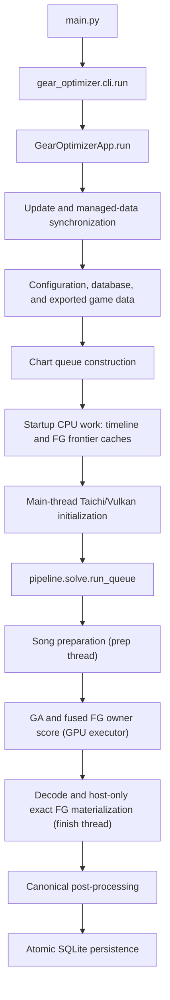
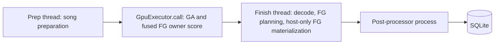
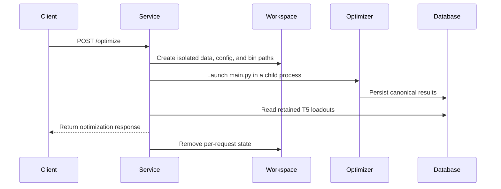

# Architecture

RoBeats Calculator Engine is a GPU-first optimization system with explicit
ownership boundaries for search, exact scoring, Force Great planning, and
persistence. This page follows the current production code. For a file-oriented
index, see [NAVIGATION.md](NAVIGATION.md).

## Runtime surfaces

The repository has two supported runtime surfaces:

- the command-line optimizer, which runs a selected chart queue; and
- the HTTP service, which isolates each optimization request and launches the
  command-line optimizer in a child process.

The outer genetic search is heuristic and budget-bounded. Exactness claims apply
to evaluation of supported score and timing surfaces and to canonical rescore,
not to exhaustive enumeration of every possible loadout.

## Command-line optimizer

```mermaid
flowchart TD
    A["main.py"] --> B["gear_optimizer.cli.run"]
    B --> C["GearOptimizerApp.run"]
    C --> D["Update and managed-data synchronization"]
    D --> E["Configuration, database, and exported game data"]
    E --> F["Chart queue construction"]
    F --> G["Startup CPU work: timeline and FG frontier caches"]
    G --> H["Main-thread Taichi/Vulkan initialization"]
    H --> I["pipeline.solve.run_queue"]
    I --> J["Song preparation (prep thread)"]
    J --> K["GA and fused FG owner score (GPU executor)"]
    K --> L["Decode and host-only exact FG materialization (finish thread)"]
    L --> N["Canonical post-processing"]
    N --> O["Atomic SQLite persistence"]
```

`GearOptimizerApp._run_single_iteration()` owns startup ordering:

1. synchronize the client and optional managed frontier data;
2. load configuration, resolve paths, and apply the memory guard;
3. initialize SQLite and synchronize exported game data;
4. load stats, gear, minis, and the selected chart queue;
5. build or verify timeline and Force Great response-frontier caches;
6. initialize Taichi/Vulkan on the main thread; and
7. solve the queue of `domain.jobs.SongTask`s (one per song run) with `pipeline.solve.run_queue`.

Taichi initialization happens before worker scheduling because the device
runtime is process-global and must have one unambiguous owner.

## Execution and ownership

`gear_optimizer/pipeline/solve.py` solves the queue in one optimizer process
with a single device owner: one GA runs at a time on the GPU executor while a
prep thread prepares the next songs and a finish thread finishes the previous
ones.

```mermaid
flowchart LR
    A["Prep thread: song preparation"] --> B["GpuExecutor.call: GA and fused FG owner score"]
    B --> C["Finish thread: decode, FG planning, host-only FG materialization"]
    C --> D["Post-processor process"]
    D --> E[("SQLite")]
```

The main execution owners are:

- `gear_optimizer/pipeline/solve.py` for the song stages and the queue;
- `gear_optimizer/pipeline/song.py` for the state of a song being solved and
  `pipeline/prepare.py` for its preparation;
- `gear_optimizer/pipeline/ga.py` for the GA request and its decode;
- `gear_optimizer/pipeline/fg.py` for Force Great preparation, planning and
  results;
- `gear_optimizer/pipeline/progress.py` for records, progress and completion;
- `gear_optimizer/solver/gpu_executor.py` for all GPU execution: one owner
  thread initializes Taichi and runs every GPU call.

Force Great payload materialization is CPU-only and runs on the finish thread;
it never initializes or accesses the GPU.

## Search, scoring, and Force Great frontiers

### Genetic search

- `gear_optimizer/solver/genetic_pipeline.py` constructs native GA requests.
- `gear_optimizer/solver/genetic_pipeline_decode.py` decodes retained device
  results.
- `gear_optimizer/solver/taichi_gem/api/` is the public Taichi solver surface.
- `gear_optimizer/solver/taichi_gem/kernels/` contains device kernels.

Production scoring imports through the public Taichi API or GPU service rather
than reaching into kernel internals.

### Exact score and timing authority

- `gear_optimizer/solver/scoring/` owns integer score evaluation and canonical
  rescore.
- `gear_optimizer/solver/fever_timeline.py` owns Fever timeline semantics.
- `gear_optimizer/solver/timeline_exact_frontier.py` constructs exact,
  non-dominated timing surfaces.
- `gear_optimizer/solver/timing_envelope.py` applies the selected timing model.

CPU exact scoring is a production canonicalization boundary as well as a parity
oracle. It is not a silent recovery path for failed GPU execution.

### Force Great ownership

Force Great behavior is split by responsibility:

- `gear_optimizer/solver/fg_response_scoring/` owns high-level planning,
  reduction, replay, and service contracts;
- `gear_optimizer/solver/taichi_gem/force_greats/response_frontier.py` owns the
  device response-frontier implementation and related response modules;
- `gear_optimizer/solver/fg_response_frontier_cache_prebuild.py` owns startup
  cache construction; and
- `gear_optimizer/solver/scoring/` owns canonical exact rescore of retained
  Force Great results.

Response-frontier identity includes the chart and score semantics that can
change a result. A missing or incompatible exact surface is an error.

## Post-processing and persistence

`gear_optimizer/pipeline/post_processor.py` runs in a separate process. Each
solved song arrives as a `SongSolve` (`pipeline/results.py`: the GA surface and
the Force Great results the FG stage published); `pipeline/canonical.py` turns
it into store rows (the exhaustive meta gem re-solve, exact replays, identity
and stats, each computed once) and the post-processor merges them with
`store.db.store_results()` and prints what the database holds. Every Force
Great result the FG stage evaluated stays attached to its loadout with its
replay, whether or not it beats the meta score; the store's FG board lists
only those that do.

The database boundary is `gear_optimizer/store` (see DATABASE_SCHEMA.md):
`schema` for connections, the DDL and migrations; `boards` for board order and
the merge of new results; `db` for reads and writes; `records` for the typed
rows. One row per loadout holds its meta and Force Great results; each board
has its own ranking. `store.db.store_results()` merges a processed song's
results into its boards in one transaction.

## HTTP service

`gear_optimizer/robeatsmeta_service.py` exposes the supported service boundary:

- `GET /songs` returns the available chart catalog;
- `POST /optimize` runs an official or supplied chart; and
- `/metafinder/v1/*` serves optional authenticated distribution metadata.

```mermaid
sequenceDiagram
    participant Client
    participant Service
    participant Workspace
    participant Optimizer
    participant Database

    Client->>Service: POST /optimize
    Service->>Workspace: Create isolated data, config, and bin paths
    Service->>Optimizer: Launch main.py in a child process
    Optimizer->>Database: Persist canonical results
    Service->>Database: Read retained T5 loadouts
    Service-->>Client: Return optimization response
    Service->>Workspace: Remove per-request state
```

Non-loopback binding requires `ROBEATSMETA_OPTIMIZER_API_TOKEN`. Each solve gets
isolated data, configuration, binary-state, and database paths so concurrent
requests cannot share mutable optimizer state.

## Core invariants

1. **One GPU owner:** orchestration submits requests; worker threads and child
   processes do not mutate Taichi/Vulkan state.
2. **Exact visible scores:** retained results pass canonical integer and timing
   rescore before persistence.
3. **Separate objectives:** Base ranking uses `score`; Force Great ranking uses
   `fg_score`.
4. **Semantic cache identity:** any chart or solver semantic that changes a
   frontier changes its cache identity.
5. **Atomic persistence:** a processed song's retained results and attempt
   counters commit together.
6. **Isolated service jobs:** request-specific files and databases never reuse
   another request's mutable workspace.
7. **Fail loudly:** malformed score payloads, missing exact surfaces,
   incompatible schemas, and GPU failures do not produce plausible fallback
   results.

## Verification layers

- CPU tests cover scoring, timeline, configuration, and data contracts.
- GPU-marked tests cover Taichi/Vulkan parity, ownership, and execution.
- `tests/test_repo_guardrails.py` checks removed surfaces, sensitive exports,
  documentation links and code paths, config examples, and GitHub math syntax.
- Maintained benchmarks (`tests/benchmark_*.py`) measure performance; they do not
  redefine correctness.
